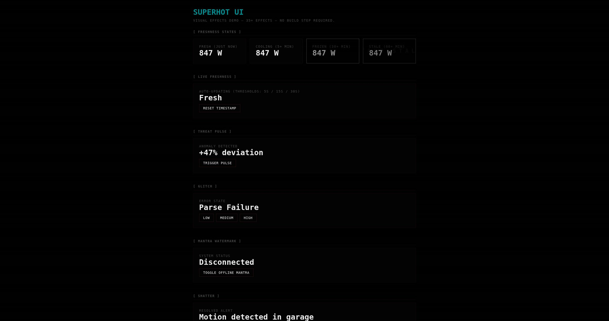
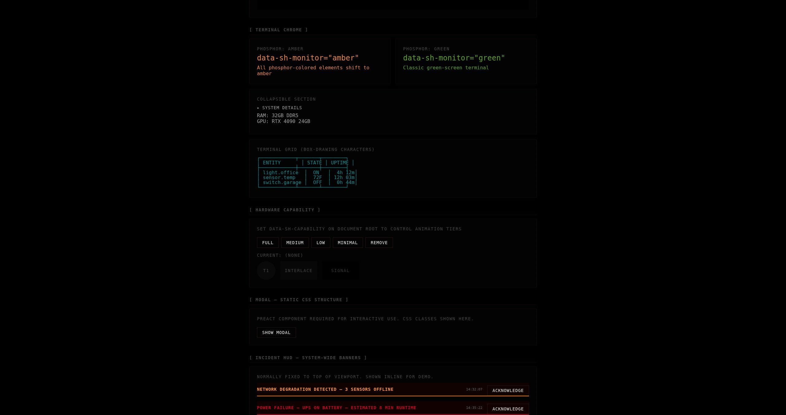
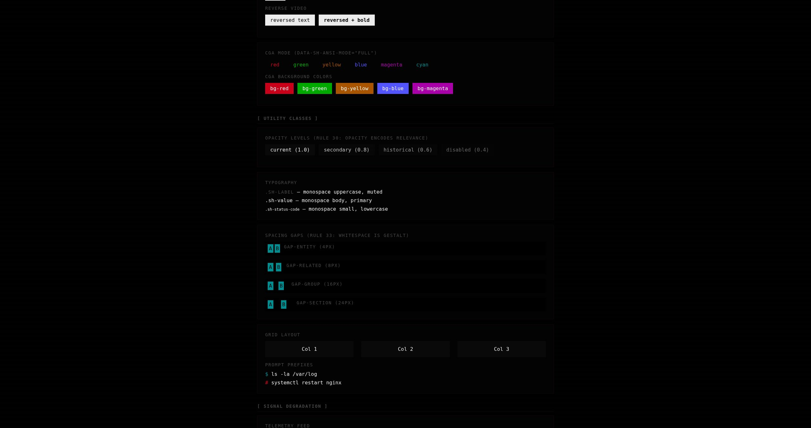
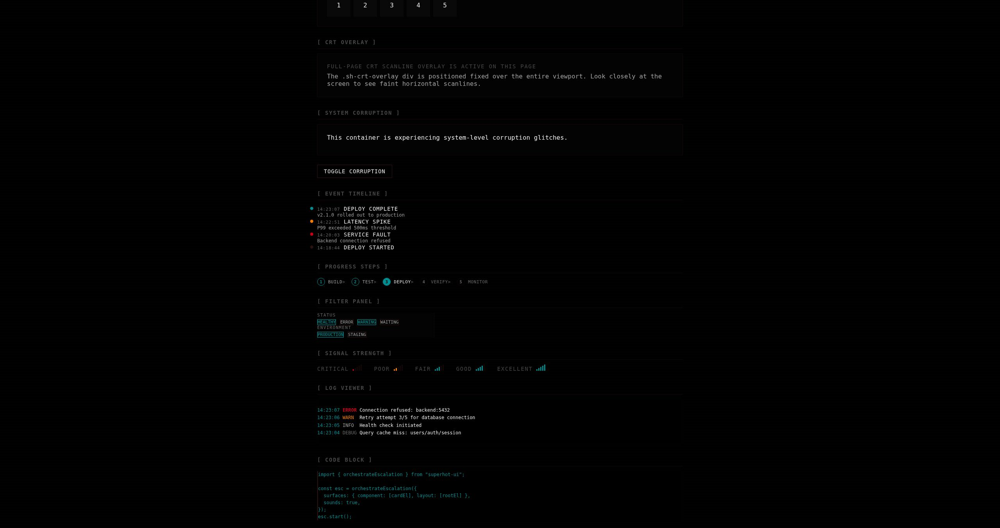
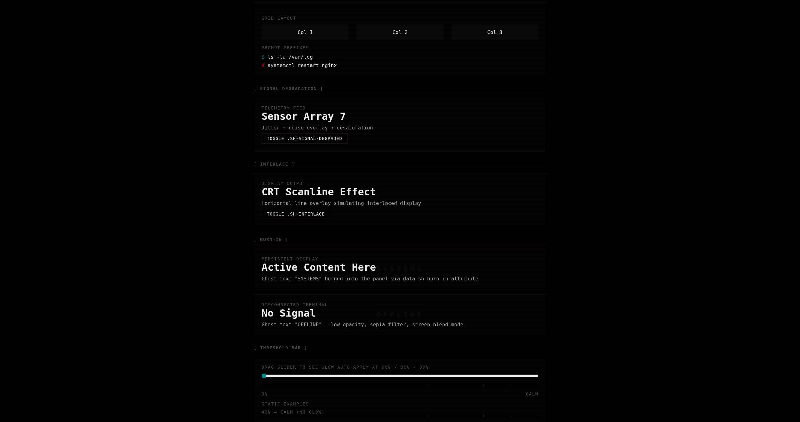

# SUPERHOT UI

> **TIME MOVES ONLY WHEN YOUR DATA MOVES.**



SUPERHOT-inspired visual effects system for operational dashboards.
CSS-first. Framework-agnostic. Diegetic-only.

Every effect communicates exactly one signal. No decoration. No noise.

**v0.3.0** | [Consumer Guide](docs/consumer-guide.md) | [CSS Reference](docs/css-classes.md) | [Demo](examples/demo.html) | MIT

---

## SYSTEM BOOT

```bash
npm install superhot-ui
```

```css
@import "superhot-ui/css";
```

```js
import { applyFreshness, heartbeat, orchestrateEscalation } from "superhot-ui";
import { ShFrozen, ShToast, ShIncidentHUD } from "superhot-ui/preact";
```

SYSTEM READY.

---

## THE EMOTIONAL LOOP

Every interaction follows one path. No branches. No shortcuts.

```
TENSION ────→ PAUSE ────→ PLAN ────→ EXECUTE ────→ CATHARSIS
   │            │           │            │              │
   ▼            ▼           ▼            ▼              ▼
 threat       mantra     command      confirm        shatter
 pulse       watermark   palette      action        fragments
 freeze      skeleton     blur       feedback      celebration
  snap       silence     target       glitch        recovery
 drone                               corrupt
```

The system escalates. You pause. You plan. You act. The system releases.

Then it starts again.

---

## WHAT IT LOOKS LIKE

### Terminal Chrome — Monitor Variants, Box Drawing, Incident Banners



### ANSI Colors, Utilities, Signal Degradation



### Event Timeline, Progress Steps, Filters, Signal Bars, Log Viewer



### Threshold Bar, Animations, Glow Hierarchy



---

## EFFECTS INVENTORY

### TENSION

| Effect             | Trigger                                         | Signal               |
| ------------------ | ----------------------------------------------- | -------------------- |
| Threat Pulse       | `data-sh-effect="threat-pulse"`                 | SOMETHING IS WRONG   |
| Freshness          | `data-sh-state="fresh\|cooling\|frozen\|stale"` | TIME IS PASSING      |
| Escalation         | `orchestrateEscalation(config)`                 | MULTI-SURFACE CRISIS |
| Tension Drone      | `setTensionDrone(level)`                        | AMBIENT PRESSURE     |
| Signal Degradation | `.sh-signal-degraded`                           | UNRELIABLE SOURCE    |

### PAUSE

| Effect    | Trigger                  | Signal                      |
| --------- | ------------------------ | --------------------------- |
| Mantra    | `data-sh-mantra="TEXT"`  | THE WORDS BEHIND EVERYTHING |
| Skeleton  | `.sh-skeleton`           | WAITING TO MATERIALIZE      |
| Burn-in   | `data-sh-burn-in="TEXT"` | PERMANENT LANDMARK          |
| Interlace | `.sh-interlace`          | PASSIVE MONITORING          |

### PLAN

| Effect          | Trigger              | Signal             |
| --------------- | -------------------- | ------------------ |
| Command Palette | `<ShCommandPalette>` | ENTER COMMAND MODE |
| Filter Panel    | `.sh-filter-panel`   | NARROW THE SCOPE   |
| Progress Steps  | `.sh-progress-steps` | SEQUENCE VISIBLE   |

### EXECUTE

| Effect            | Trigger                   | Signal             |
| ----------------- | ------------------------- | ------------------ |
| Action Feedback   | `confirmAction(el)`       | INPUT ACKNOWLEDGED |
| Glitch            | `data-sh-effect="glitch"` | REALITY HICCUP     |
| System Corruption | `.sh-system-corrupted`    | TOTAL FAULT        |

### CATHARSIS

| Effect        | Trigger                   | Signal          |
| ------------- | ------------------------- | --------------- |
| Shatter       | `shatterElement(el)`      | DESTROYED       |
| Celebration   | `celebrationSequence(el)` | RELEASE         |
| Recovery      | `recoverySequence(opts)`  | SYSTEM RESTORED |
| Boot Sequence | `bootSequence(el, lines)` | REBORN          |

---

## 24 COMPONENTS

```
PageBanner    HeroCard      StatsGrid     DataTable
Nav           TimeChart     Pipeline      Collapsible
ErrorState    Modal         IncidentHUD   MatrixRain
StatCard      StatusBadge   Toast         CommandPalette
EmptyState    CrtToggle     Skeleton      EventTimeline
ProgressSteps FilterPanel   SignalBars    Frozen
```

Form elements: `.sh-input` `.sh-select` `.sh-toggle` `.sh-tabs` `.sh-kbd`

Terminal: `.sh-log` `.sh-code` `.sh-tooltip` `.sh-breadcrumb` `.sh-prompt`

Layout: `.sh-frame` `.sh-card` `.sh-callout` `.sh-bracket` `.sh-divider`

---

## THREE LAYERS

Each optional. Use one, two, or all three.

```
CSS  ──→  data attributes, class names, zero runtime
JS   ──→  vanilla ESM utilities that set those attributes
JSX  ──→  Preact wrappers with ARIA + lifecycle
```

24 Preact components. 29 CSS component files. 21 JS utilities.

---

## BROWSER SUPPORT

| Tier          | Chrome | Firefox | Safari | Edge |
| ------------- | ------ | ------- | ------ | ---- |
| FULL FIDELITY | 123+   | 128+    | 17.4+  | 123+ |
| HEX FALLBACKS | 80+    | 75+     | 13+    | 80+  |
| ANIMATIONS    | 117+   | 129+    | 17.4+  | 117+ |
| CSS-ONLY      | 80+    | 75+     | 13+    | 80+  |

`oklch()` `light-dark()` `color-mix()` `@property` `@layer` `@starting-style` `container queries`

Hex fallbacks declared before every modern color. Older browsers see correct colors without effects.

---

## ACCESSIBILITY

`prefers-reduced-motion` disables all animation. Static indicators remain.

`:focus-visible` on all interactive elements. ARIA labels on all data components. `role="alert"` on incidents and errors. `aria-description` for freshness state announcements. Photosensitivity-safe blink rates. WCAG AA contrast on all threat colors (5:1+).

`@media (forced-colors: active)` with system colors on every component.

The system respects the operator.

---

## CUSTOMIZATION

```css
:root {
  --sh-threat: oklch(68% 0.22 25);
  --sh-shatter-duration: 400ms;
}
```

Monitor variants: `data-sh-monitor="amber|green"`

Hardware capability: `applyCapability(detectCapability())`

CRT intensity: stripe, scanline, flicker — each independently toggled.

---

## THE RULES

1. Every effect maps to exactly one signal
2. If it does not communicate, it does not exist
3. CSS first. JS when behavior requires it. Preact when lifecycle demands it
4. `prefers-reduced-motion` is law
5. The operator's attention is sacred. Never waste it

---

## DOCUMENTATION

| Doc                                            | Purpose                                  |
| ---------------------------------------------- | ---------------------------------------- |
| [Consumer Guide](docs/consumer-guide.md)       | Integration patterns + code examples     |
| [CSS Class Reference](docs/css-classes.md)     | Every `.sh-*` class with signal + file   |
| [Atmosphere Guide](docs/atmosphere-guide.md)   | 40 rules for consumer dashboards         |
| [Design Philosophy](docs/design-philosophy.md) | The four tests every component must pass |
| [Anti-Patterns](docs/anti-patterns.md)         | What NOT to do                           |
| [Recipes](docs/recipes/)                       | 5 complete integration tutorials         |
| [Component Docs](docs/components/)             | Props, usage, ARIA for all 24 components |
| [Demo](examples/demo.html)                     | Interactive showcase — no build step     |

---

## USED BY

| Project                                                      | Usage                                                              |
| ------------------------------------------------------------ | ------------------------------------------------------------------ |
| [ollama-queue](https://github.com/parthalon025/ollama-queue) | Job queue dashboard — orchestration, escalation, HostCard Now page |
| [project-hub](https://github.com/parthalon025/project-hub)   | Unified project status dashboard                                   |
| [lessons-db](https://github.com/parthalon025/lessons-db)     | Spaced-repetition lessons SPA (`/ui/`)                             |
| [FrameCast](https://github.com/parthalon025/framecast)       | Raspberry Pi photo frame — phone upload UI + kiosk slideshow       |

---

> SUPERHOT IS THE MOST INNOVATIVE DESIGN SYSTEM I'VE EVER USED.

MIT License
